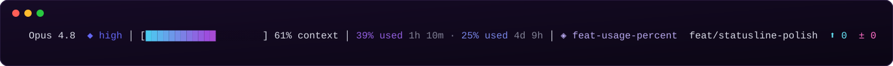

# status-line

A synthwave-styled status bar for [Claude Code](https://claude.ai/code) that shows model, effort level, context usage, and git state at a glance.

> Synthwave-styled status bar rendered at the bottom of Claude Code's terminal.



## What it shows

```
  Opus 4.8  ◆ high │ [████████████░░░░░░░░] 61% context │ 16% used 1h 57m · 22% used 4d 10h │ ✦ my-repo  main  ⬆ 2  ± 4
```

| Segment | Description |
|---|---|
| Model name | Active Claude model, cleaned up from its raw ID (`claude-opus-4-8` → `Opus 4.8`) |
| `◆ effort` | Current effort level (`low` / `medium` / `high` / `xhigh` / `max`) |
| Context bar | Token usage vs. the model's real context window (200K, or 1M on Opus 4.8), gradient cyan → purple → hot pink; label reads `61% context` |
| `X% used <reset>` (session) | Your **5-hour** usage window: percent used and time until it resets. Pulled from Claude Code's own usage data (`~/.claude.json`), the same numbers behind its native banner. |
| `X% used <reset>` (weekly) | Your **7-day** usage window: percent used and time until it resets. |
| Git | Repo icon (deterministic), branch, commits ahead of main, modified files |

The two `% used` numbers are colored on the same gradient as the context bar, scaled so they reach full pink by ~90% — you see the warning color before you actually hit the limit. Reset countdowns stay muted. If Claude Code hasn't populated its usage cache yet, the whole zone is hidden.

The context bar and effort display animate at higher levels — `xhigh` pulses, `max` cycles through rainbow colors.

## Requirements

- macOS or Linux with a truecolor terminal
- `python3` (standard on both)
- Claude Code with `statusLine` support

## Installation

1. Clone the repo somewhere permanent:

```bash
git clone https://github.com/matthewpimenta/status-line.git ~/status-line
```

2. Make the script executable:

```bash
chmod +x ~/status-line/status.sh
```

3. Add this to your `~/.claude/settings.json` under the top-level object:

```json
"statusLine": {
  "type": "command",
  "command": "/path/to/status-line/status.sh ${CLAUDE_CODE_SESSION_ID} ${CLAUDE_EFFORT}",
  "refreshInterval": 1
}
```

Replace `/path/to/status-line` with wherever you cloned it (e.g. `~/status-line`).

4. Restart Claude Code. The status line appears at the bottom of the terminal.

## Color palette

| Element | Color |
|---|---|
| Model name | `#4CC9F0` sky cyan |
| `◆ low` | `#EAB308` amber |
| `◆ medium` | `#22C55E` green |
| `◆ high` | `#6366F1` indigo |
| `◆ xhigh` | Pulsing purple animation |
| `◆ max` | Rainbow cycle (red → amber → cyan → teal → blue → magenta) |
| Bar 0–50% | `#4CC9F0` → `#9D4EDD` gradient |
| Bar 50–100% | `#9D4EDD` → `#FF2D78` gradient |
| Bar empty | `#0C0416` near-black |
| Session / weekly `% used` | Shared bar gradient, scaled so full pink hits by ~90% |
| Reset countdowns | `#808094` muted gray |
| Branch | `#FFE600` gold |
| Commits ahead `⬆` | `#67E8F9` soft cyan |
| Modified `±` | `#FF6EC7` pink |
